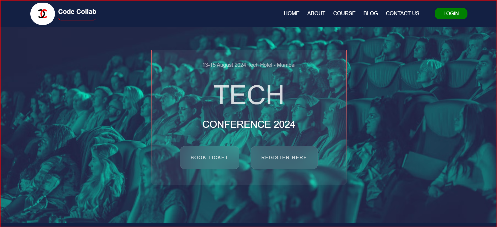

# Project Title
Code-Collab

## Introduction
This project is the web conference app that helps to fix tech meetings, only we have to just register for a particular conference. Purpose of this project is to reduce the time and save money both. By using this Web app we can fix a conference, manage previous conferences, check all the list of the speakers and many more. This Web App solves the money and time problem.

## Project Type
Frontend

## Deplolyed App
Frontend: https://669cfa149b863d149d4addfc--calm-griffin-225933.netlify.app/

## Directory Structure
code-collab/
|--index.html
|--.gitignore
|--script.js

## Video Walkthrough of the project
[Project_Presentation](https://www.youtube.com/watch?v=QCtp0gjSV7Q)

## Features
List out the key features of your application.

- Register for a conference.
- Responsive
- Animation

## design decisions or assumptions
1. Modular Architecture: Implement a modular architecture to facilitate scalability and maintainability.
   Rationale: This allows for easy addition of new features and improvements without disrupting existing functionality.

2. Responsive Design: Ensure the platform is fully responsive and accessible on various devices (desktops, tablets, and smartphones).
   Rationale: Users should be able to manage tasks and projects on-the-go, enhancing flexibility and productivity.

## Usage
1. Open the Project in the VS Code 
2. Go To index.html file
3. Run the index.html on live server

## Technology Stack
List and provide a brief overview of the technologies used in the project.

- HTML5
- CSS3
- JavaScript
- Bootstrap
- Tailwind